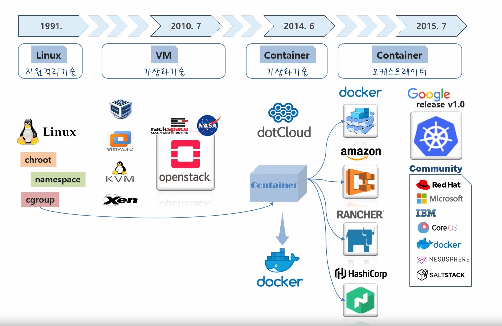
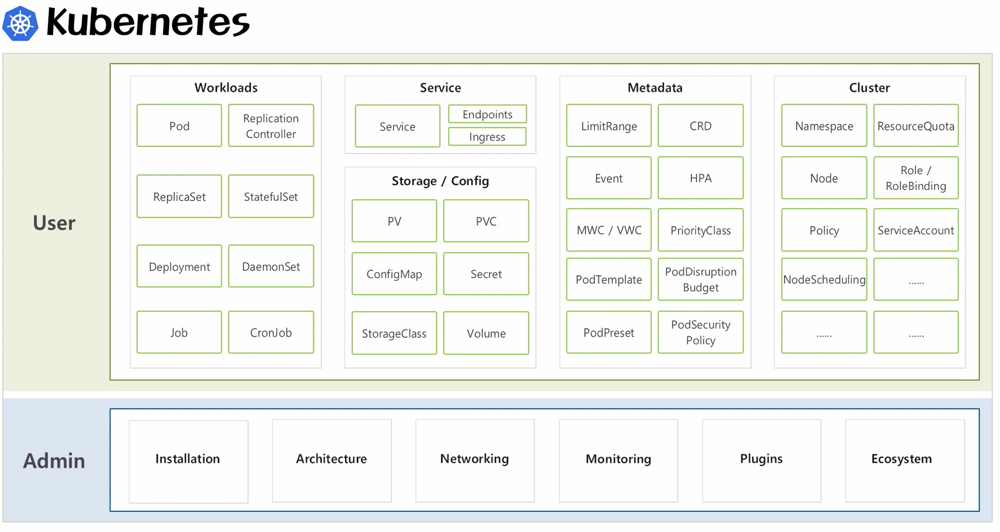

### Introduction
- 배포관리 서비스 유지보수에 관한 개념
- Container, Docker, Kubernetes
- 중국이 가장 큼
	- Alibaba
	- WeChat
	- Naver
	- Line
	- 배달의 민족
- Why Enterprise use Kubernetes?
	- 큰 기업들은 대규모의 서비스를 운영
	- 최대한 자원을 효율적으로 써야 비용적으로 유리
	- 서버자원 효율적 사용
---
### 가상화 기술History
- **1991- Linux**
	- Linux
		- chroot
		- namespaces
		- cgroup
	- VM
		- vm
		- KVM
		- Xen
- **2010.7 - VM**
	- rackspace, nasa
		- openstack
	 - 한계점 원인
		- VM가상화를 위해서 `무거운OS` 띄어야함
		- 가벼운 서비를 하나 띄우기 위해 이보다 더 큰 OS를 띄워야함
- **2014.6 - Container**
	- dotCloud -> docker 사명 변경
	- Container
		- 서비스간에 자원격리를 하는데 OS를 별도로 안띄움
		- OS 기동시간이 업기 대문에 자동화시에 빠르고 자원 효율적으로 배분
	- Docker
		- 하나의 서비스를 `Container`로 배포 
		- 엄청 많은 서비스 운영할때 배포하고 운영하는 역할을 안함
- **Container Orchestrator**
	- Container Orchestrator
		- 여러 Container를 배포 운영 관리를 도와줌 (컨테이너 관리 솔루션)
	- amazon
	- rnacher
	- hashicopr
	- docker
- **2015.7 - Kubernetes**
	- Google release 1.0 kubernetes
	- Community
		- Red Hat
		- MS
		- IBM
		- CoreOS
		- Docker
		- MESOSPHERE
		- SALSTACK
- **Today**
	- Kubernetes
	- GCP
	- AWS
	- Azure
	- IBM Cloud
	- Oracle Cloud

### 강좌 범위
- User입장에서 서비스
- 향후 중급편에서 Admin 관점 서비스

---
#### Contents
1. Why Kubernetes?
2. VM vs Container
3. Getting started - Kubernetes
4. Kubernetes Overview
5. Object
	- Pod
	- Servcie
	- Volumn
	- Configmap, Secret
	- Namespace, ResourceQuota, LimitRange
6. Controller
	- Replication Controleer/ ReplicaSet
	- Deployment
	- DaemonSet/ Job/ Cron Job
